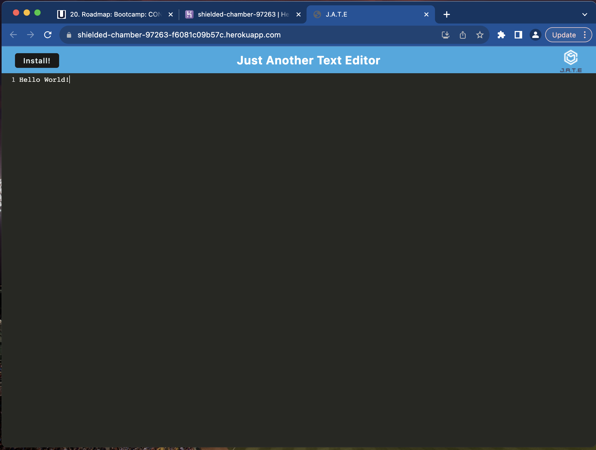
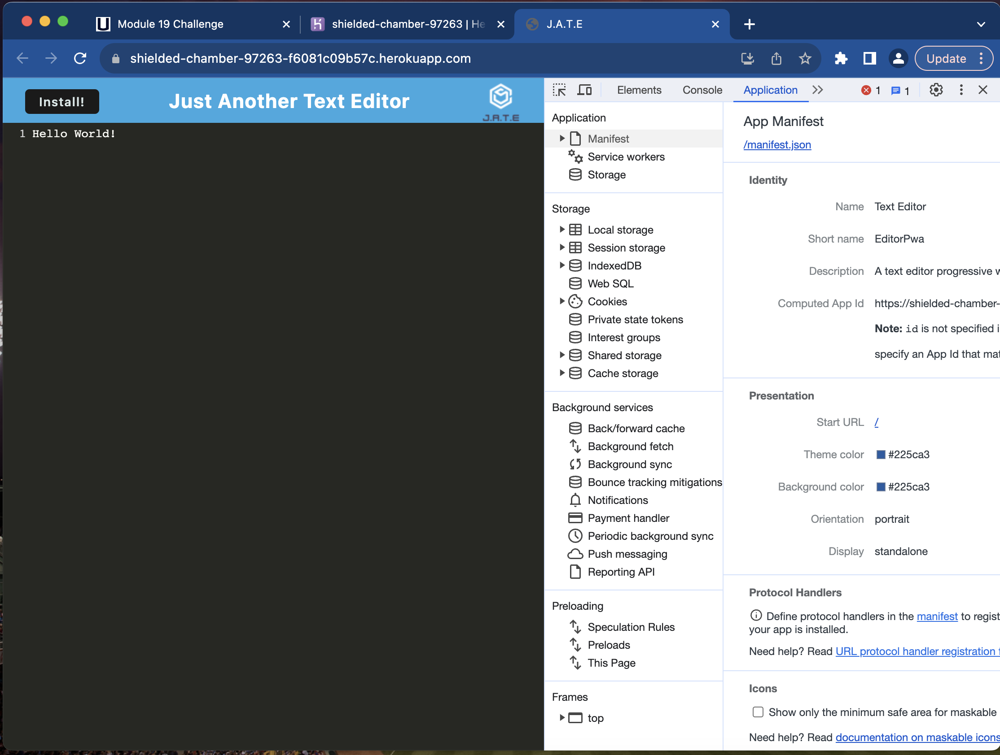
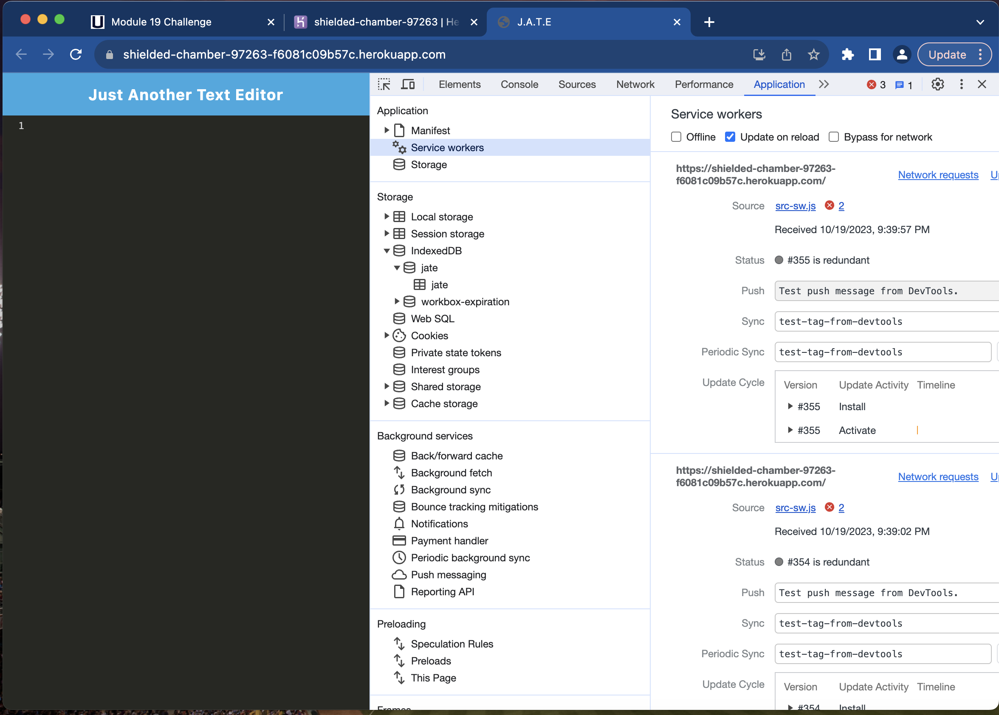

# Text Editor PWA  
  ## Table of Contents:
  [Description](#description)
  [Installation Instructions](#installation-instructions)
  [Questions](#questions)
  [Screenshots](#screenshots)

  ## Description:
  This project was created for a user to be able to save notes or code snippets even without an internet connection. The project uses IndexedDB for saving the content created, webpack for bundling, and service workers and workbox to handle offline capabilities. This project can be seen as an example of a progressive web application due to its offline caching and ability to be installed.

  ## Installation Instructions
  To install this project locally, clone this repository and cd into the projects directory in the command line. Run npm install, followed by npm run build and npm start. The application will run at localhost:3000. Optionally, the application offers installation capability when the site is visited. Simply open the [application here](https://shielded-chamber-97263-f6081c09b57c.herokuapp.com/) and click the install button in the top left corner.

  ## Screenshots
  
  
  
  

  ## Questions
  Please direct questions to [github.com/cslunsford](github.com/cslunsford) at [christopher.lunsford@uconn.edu](christopher.lunsford@uconn.edu).